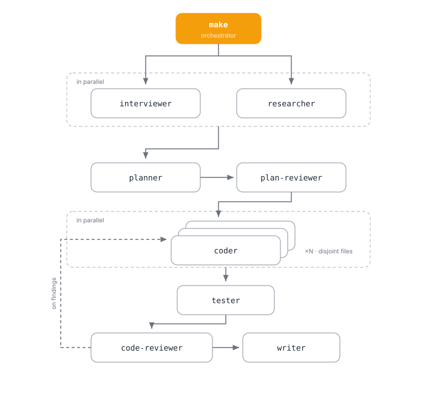

# @alexeyco/opencode-workflow

A complete multi-agent engineering team for OpenCode v2 — one orchestrator primary (`drive`), 9 specialized subagents, and two skills (`workflow-driver` + `workflow-subagent`) — in one plugin.

<p align="center">
  
</p>

## Why

- **Delegation-first orchestration.** `drive` breaks work into parallel waves, gates each wave on a Definition-of-Done, and never falls back to "do it yourself" — subagents own the work end-to-end.
- **10 role-tuned agents, role-scoped permission sets.** Each agent ships with the narrowest permission set it needs; no agent gets more than its role requires.
- **Skills stay yours.** Agents see every skill installed in your environment; tune access per agent from `opencode.jsonc`.
- **Coexists with stock `plan` / `build`** — the plugin no longer removes
  them; to disable them yourself:
  [docs/agents.md#built-in-plan--build-agents](docs/agents.md#built-in-plan--build-agents).

## What you get

| Agent           | Role                                              |
| --------------- | ------------------------------------------------- |
| `drive`         | workflow orchestrator — routes work to subagents  |
| `coder`         | implementation                                    |
| `tester`        | tests and test runs                               |
| `debugger`      | defect diagnosis: reproduce, minimize, root-cause |
| `researcher`    | codebase and docs exploration                     |
| `planner`       | plan drafting                                     |
| `plan-reviewer` | plan critique                                     |
| `code-reviewer` | diff critique                                     |
| `interviewer`   | requirements elicitation                          |
| `writer`        | docs and copy                                     |

Full catalog with modes, frontmatter descriptions and the permission
matrix: [docs/agents.md](docs/agents.md).

## Install

```jsonc
// opencode.json(c)
{
  "plugins": ["@alexeyco/opencode-workflow"],
}
```

OpenCode v2 native key is `plugins`; opencode installs the npm package automatically. Then restart opencode and switch the primary agent to `drive`.

## Usage

- Talk to `drive` in natural language — it routes work through subagents per the `workflow-driver` skill.

## Tuning subagent skill access

By default every agent **except `drive`** may load **all** skills
discovered by opencode; `drive` is `workflow-driver`-only. Defaults and
discovery paths: [docs/skills.md](docs/skills.md#default-state).

Your `opencode.jsonc` rules are applied **after** the plugin's rules —
last match wins ([composition order](docs/skills.md#composition-order--why-your-rules-win)).
To restrict a subagent, deny skills categorically with
`{ "action": "skill", "resource": "*", "effect": "deny" }`, then
re-allow what the role needs — the kept set must always include the
mandatory `workflow-subagent`.

Full worked example and more recipes: [docs/skills.md](docs/skills.md#recipe--restrict-coder-to-two-companion-skills).

> Keep `workflow-driver` allowed for `drive` and `workflow-subagent`
> allowed for every subagent — the plugin's methodology breaks without
> them; canonical warning: [docs/skills.md](docs/skills.md#recipe--give-drive-extra-skills).

## Companion skills (optional)

The methodology is designed to pair with companion skills such as
`grilling`, `writing-plans` or `test-driven-development` when installed
in your environment — they are **not bundled** and steps degrade
gracefully when one is missing. Full role mapping:
[docs/skills.md](docs/skills.md#companion-skills).

## Models

Agents ship **unpinned** and inherit your default model. Recommended
tier classes and the pin recipe:
[docs/agents.md#model-guidance](docs/agents.md#model-guidance).

## Adopting the plugin

If you previously kept hand-written copies of these agents / skills in `~/.config/opencode`, remove the duplicates (`agents/*.md`, `skills/workflow-driver`, `skills/workflow-subagent`) to avoid double registration.

## See also

- [docs/agents.md](docs/agents.md) — full catalog + permission tables.
- [docs/skills.md](docs/skills.md) — skill-access tuning deep-dive.
- [CONTRIBUTING.md](CONTRIBUTING.md) — development and release workflow.
- [CHANGELOG.md](CHANGELOG.md).
